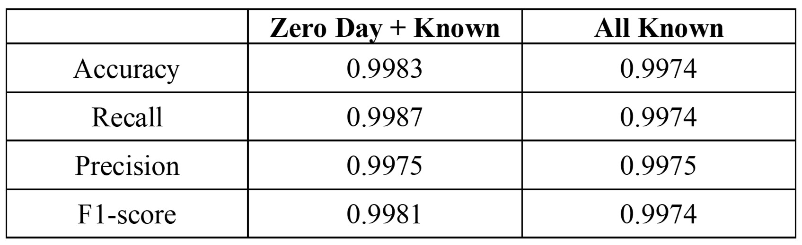

# Future-Proofed Intrusion Detection for Internet of Things with Machine Learning

This repository contains the code associated with the paper:

> Adeyemi, T., Ngobigha, F., & Ez-Zizi, A. (2025). Future-proofed intrusion detection for Internet of Things with machine learning. In *2025 IEEE 4th International Conference on AI in Cybersecurity (ICAIC)* (pp. 1-6). https://doi.org/10.1109/ICAIC63015.2025.10848845. 

## Dataset

The code in this repository relies on the **CICIoT2023 dataset**, which is publicly available from the [Canadian Institute for Cybersecurity](https://www.unb.ca/cic/datasets/iotdataset-2023.html). Please download the dataset from the official website and place the required files in the appropriate directory before running the code.

---

## Code

The script is structured into four main parts:

### I. Data preparation

1. **Combining data into a single dataframe**  
   - Combines all 169 CSV files from the CICIoT2023 dataset into a single dataframe, which is shuffled and exported for subsequent steps.  
   - **Note:** This step requires a large amount of RAM (~64GB).

2. **Creating a balanced dataset**  
   - Ensures equal representation of benign and attack instances in the dataset.  
   - Excludes specific features (e.g., `ece_flag_number`, `cwr_flag_number`, `Telnet`, `SMTP`, `DHCP`) based on low variance or other criteria, and log-transform skewed features.

3. **Preparing balanced dataset for modeling**  
   - Further preprocessing of the balanced dataset, preparing it for training machine learning models.

### II. Detection of existing malware attack types

1. **Binary classification (benign vs. attack)**  
   - Trains three classifiers: **XGBoost**, **Random Forest**, and **Decision Tree**, to distinguish between benign and attack data.  
   - Bonus: Evaluates on left-out attack data to further validate the best model.

2. **8-class classification**  
   - Trains and evaluates models to distinguish between benign and 7 attack classes.  

3. **34-class classification**  
   - Trains and evaluates models to distinguish between benign and 33 attack classes.  

---

### III. Effect of dataset size on binary classifier performance

Creates a learning curve for the test F1-score improvement with training data size

---

### IV. Testing the binary intrusion detection system on unseen attack types

Tests the trained models on unseen attack types not included during training.  

---

## Contributors

Dr Adnane Ez-zizi & Taiwo Adeyemi. 

---
